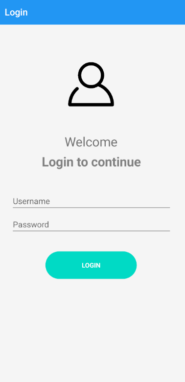
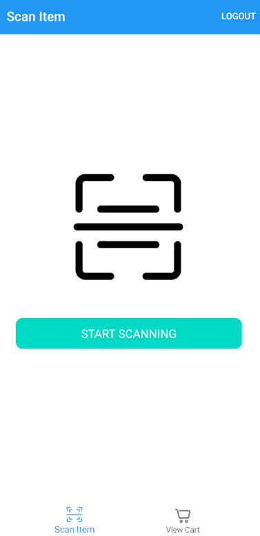
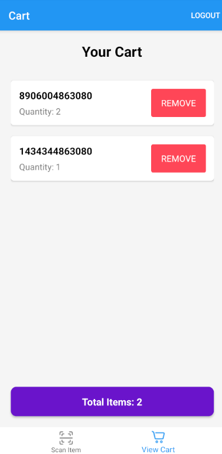

# Scanner App

A mobile barcode/QR code scanner application built with Xamarin.Forms that allows users to scan products, add them to a cart, and manage their shopping experience.

## Features

- **User Authentication**: Secure login system to personalize the user experience
- **Barcode/QR Code Scanning**: Scan product barcodes quickly and efficiently
- **Shopping Cart Management**: Add, remove, and manage scanned items in your cart
- **Cross-Platform**: Works on iOS and Android devices

## Screenshots

### Login Screen

*Screenshot showing the app's login interface*

### Scanner Interface

*Screenshot demonstrating the barcode/QR code scanning functionality*

### Cart Management

*Screenshot of the shopping cart interface with scanned items*

## Technologies Used

- Xamarin.Forms 5.0.0
- ZXing.Net.Mobile 2.4.1 for barcode scanning
- Newtonsoft.Json 13.0.3 for data serialization
- Xamarin.Essentials 1.8.1 for platform-specific features

## Installation

1. Clone the repository
2. Open the solution in Visual Studio
3. Restore NuGet packages
4. Build the solution
5. Deploy to an emulator or physical device

## Usage

1. Launch the app
2. Log in with your credentials
3. Use the scanner to scan product barcodes
4. View and manage your cart

## Project Structure

- **Views**: Contains the UI components (LoginPage, ScannerPage, CartPage)
- **ViewModels**: Implements the MVVM pattern for data binding and UI logic

## Requirements

- Visual Studio 2019 or higher
- .NET Standard 2.0
- iOS 10+ or Android 5.0+

